

  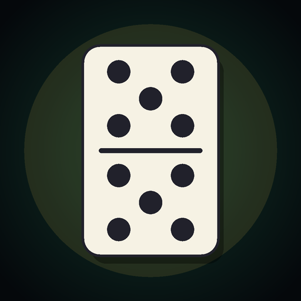

<h1 align="center">DominoGue</h1>

<b>A roguelike dominoes game.</b> Play All-Fives, deal damage with every scoring move, and climb <i>The House of Bones</i> — a bottomless tower of opponents, shops, and Wardens.

  
  
  
  
  
  

  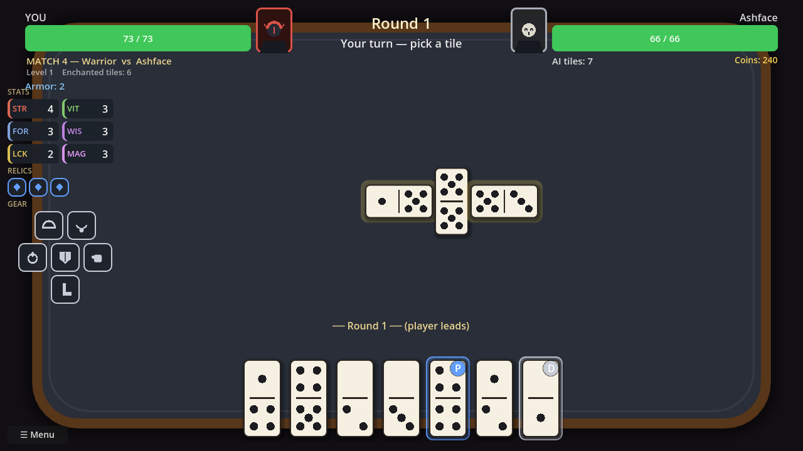

---

## ▶ Download & Play (Windows)

1. Open the **[latest release](https://github.com/yodahlorian/dominogue/releases/latest)** and download the **`.zip`**.
2. **Unzip it** anywhere — it's a single self-contained **`DominoGue.exe`** (nothing else to unpack).
3. **Double-click `DominoGue.exe`.** On first launch, enter your **product key** to activate — one time,
   online; after that the game verifies your license offline and runs without a connection.

> **Need a product key?** Keys are issued by the developer — email **Yodahlorian@gmail.com** to get one.

> If Windows SmartScreen warns you, click **More info → Run anyway** — it's an unsigned indie
> build, not malware. There's a full **How to Play** screen on the main menu, and your progress
> saves automatically to `%APPDATA%\DominoGue`.

> **Prefer not to use a key?** The full game is also available to **[purchase on itch.io](https://deviousdevelopments.itch.io/dominogue)** — a Windows download that plays instantly, no product key.

## ▶ Try the Free Demo (Browser)

Not sure yet? Play the **[free browser demo on itch.io](https://deviousdevelopments.itch.io/dominogue)** —
no download, no product key. It runs through **Act 1** (up to and including the first Warden) with three
classes, in any modern desktop browser. The **full game** is available to purchase on the same page.

## ✦ What it is

All-Fives dominoes turned into a roguelike run. Every tile you place that drives the board's open
ends to a **multiple of 5** deals that much **damage**. Choose a soul, climb the tower, get
stronger, and gamble your way to the Vault.

- ♟ **All-Fives combat** — scoring plays deal damage; a live HUD shows the current board total.
- 🎯 **The spinner** — the first double opens four directions; doubles score both pips while open, **zero** once closed.
- 🗺 **Branching climb** — after each fight pick 1 of 2: **Battle · Shop · Blacksmith · Treasure · Bonfire · Boss**.
- ✨ **Boon & Doom enchants** — every domino can carry a **boon** (helps you when *you* play it) and a **doom** (hurts the AI when *it* plays it). Both **double when the play scores**.
- 💎 **Relics & gear in five rarities** — **Common · Rare · Epic · Legendary · Mythic** — with tier-scaled, build-defining bonuses.
- 🎒 **Equipment & inventory** — six armor slots on a paper-doll; each class starts in a themed set. Swap gear, upgrade it at the **Blacksmith**, sell what you outgrow.
- 📈 **Stats, leveling & crits** — STR / VIT / FOR / WIS / **LUCK**; earn XP, raise a stat each level, and land critical hits.
- 🧙 **Five classes** — Warrior, Mage, Gambler, plus the **Oracle** and **Spy** you unlock as your legend grows.
- 🏆 **Meta-progression** — characters **keep their levels & stat points between runs**; **respec** anytime and **reset** whenever you like.
- 🏅 **25 achievements** — each grants a **permanent** reward on every future run: small stat / HP / gold buffs, plus **6 unlocks** — a golden domino skin, an alternate table theme, a free relic each run, a secret Mythic relic, a secret Legendary boon, and a whole harder **Ascension Mode**. Track them in the **Trophy Room**.
- 👹 **Named opponents & Wardens** — each with a portrait, a taunt, and their own table; a **cutscene** frames every fight.
- 🖱 **Drag & drop** — drag tiles onto the board; open ends glow **green** (playable) or **red**.
- 🚪 **Quit a run** anytime from a battle's pause menu or the path.
- 🔊 **Full soundtrack & sound** — a dark-fantasy menu theme, **five battle tracks that rotate per fight**, and a shop theme, with sound on everything: bonfire crackle, the Blacksmith's anvil, victory & defeat stings, trophy and level-up chimes, and tile-place / hit / coin feedback. Music & SFX volume sliders in Settings.
- 😈 **Studio splash** — a hand-drawn **Devious Developments** intro plays into the title on launch (click to skip).

## 📖 Story — *The House of Bones*

You died mid-wager, owing a debt you could never pay — and the House dealt you in. Climb the
**Stack**, and the Dealer narrates every stair. Each act ends with a **Warden** who gambles not
to win, but to *keep* you; beat one and a **Memory Shard** of your past life comes loose. Five
shards per class assemble a different soul's story, and the **Vault** at the top offers a final
hand and a **choice of two endings** — walk back into life, or stay and become a Warden yourself.

  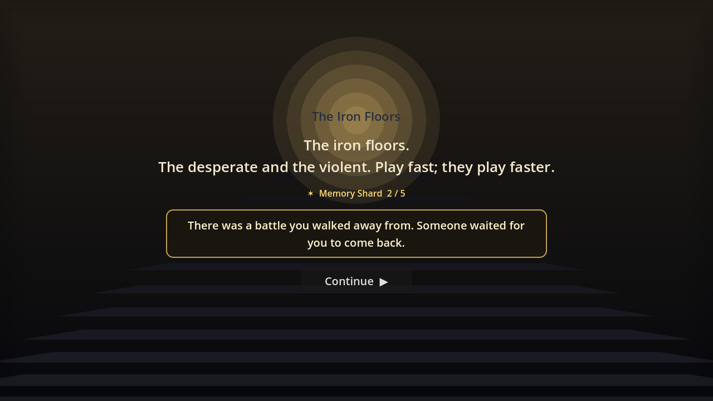
  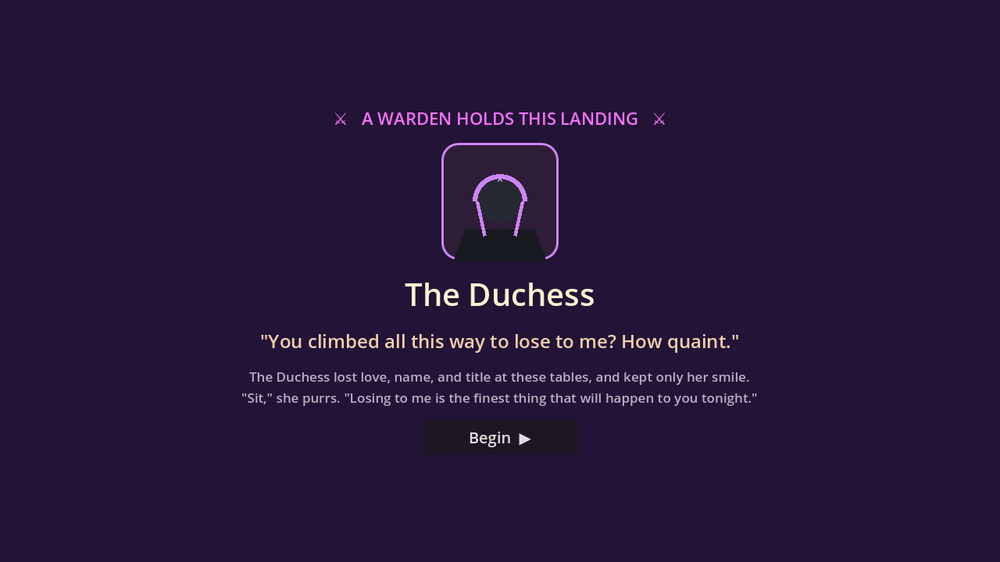

## 📸 Screenshots

| Main menu | Choose your path |
|---|---|
| 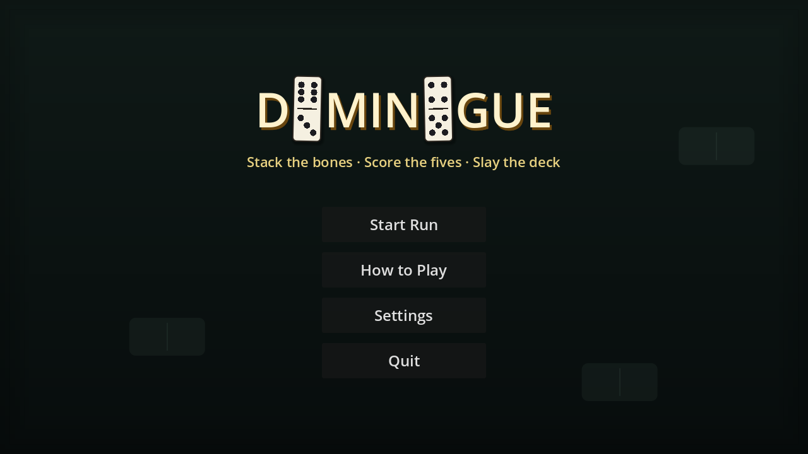 | 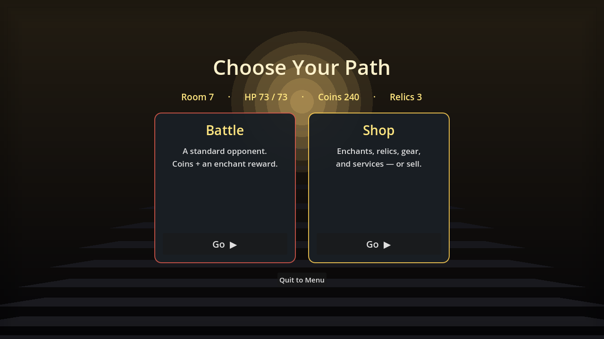 |
| **The shop** | **How to play** |
| 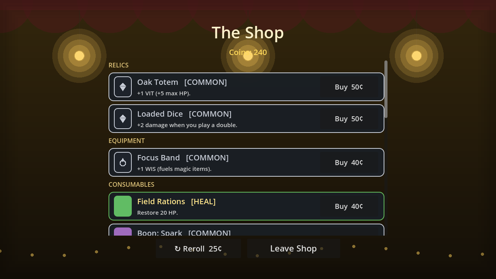 | 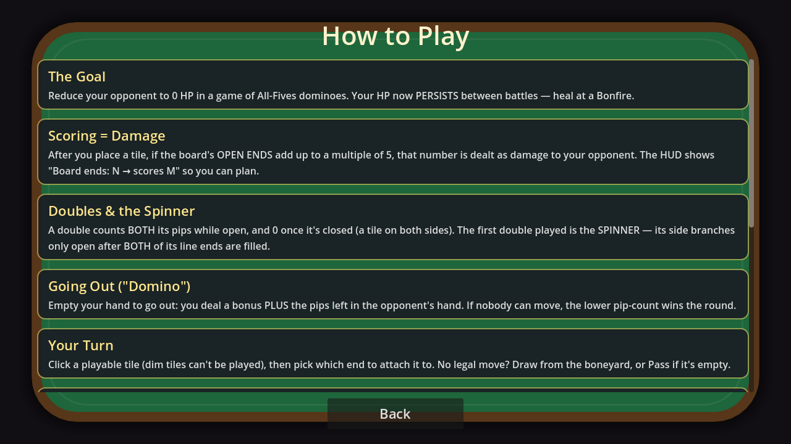 |
| **The Trophy Room** | **Studio splash** |
| 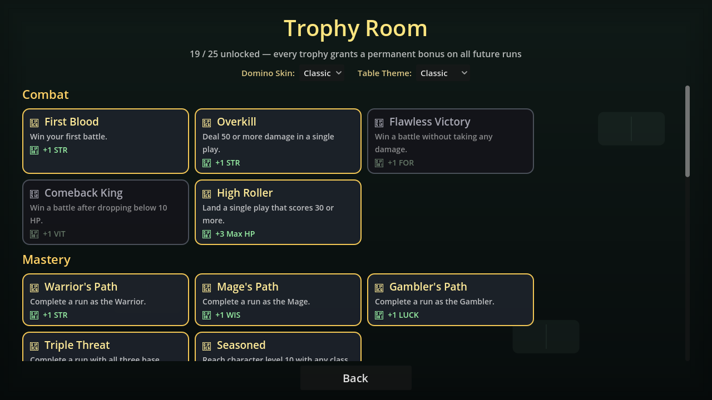 | 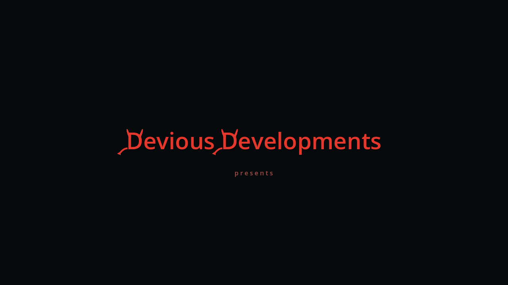 |
| **Activate your copy** *(desktop build)* | **A match in progress** |
| 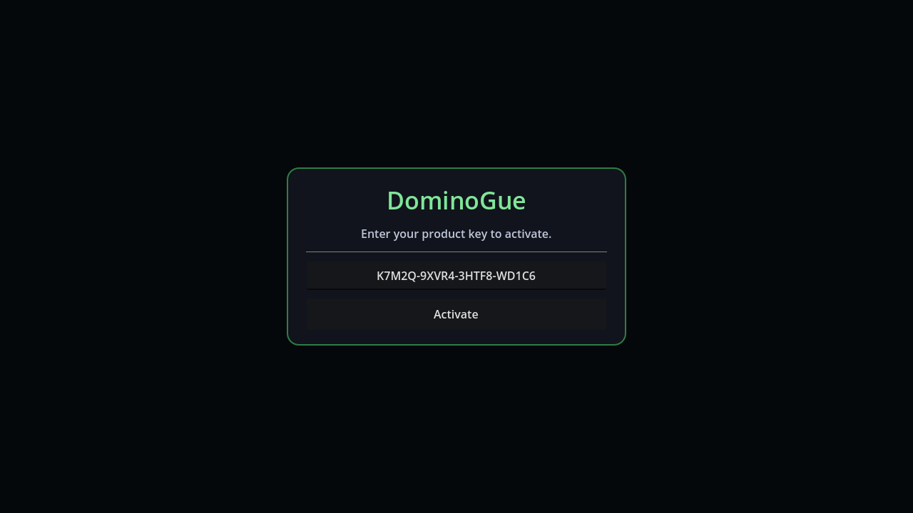 |  |

## 🧪 Feedback & bug reports

Please open an **[Issue](https://github.com/yodahlorian/dominogue/issues/new)** for anything:

- Scoring that looks **wrong** (especially doubles / the spinner).
- **Boon / Doom** enchants — do they feel impactful, especially the "double when scored" payoff?
- **Difficulty** spikes or pushovers — including how spongy **bosses** feel with their armor.
- **Relic / gear / price** balance that feels off for the rarity.
- **Crashes, soft-locks, or UI glitches** (a turn you can't take, a dead button).
- The **story** — any awkward Stairwell or Warden lines, or pacing that drags?
- Anything **confusing** — where did you get stuck or lost?

Include what you did, what happened, what you expected, and your depth/class. Screenshots help.

## 📓 Changelog

See **[CHANGELOG.md](CHANGELOG.md)**.

---

Built with Godot 4.3 · Windows &amp; Web · © 2026 Yodah — all rights reserved.

